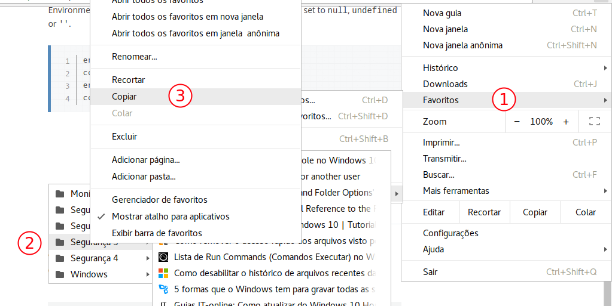
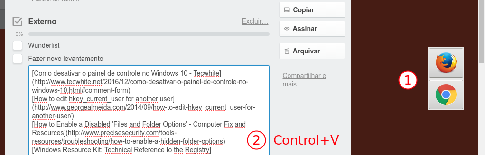

treclip
=======

> Making checklists and comments in Trello from bookmarks

Dependencies
------------

- bash
- sqlite3
- xclip
- bookmarker - [_my fork_](/alexandre-mbm/bookmarker)
- yad
- wmctrl

Use
---

```console
$ export PATH=$PATH:DIRECTORY/bookmarker
$ sh DIRECTORY/treclip/treclip.sh
```

### 1. Copy the bookmark folder



### 2. Prepare and use the clipboard



License
-------

[MIT](LICENSE.md)
